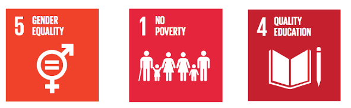

# SiDo
Our educational system have failed to achive full inclusion, promote diversity and ensure full and equal opportunities for employment. 

We belive that lifelong learning can help promote gender equality, ensure equal access to employment, and ensure that everyone is included in the information socitey. 

# Intro

- <a href="#problem">Problem</a>

- <a href="#solution">Solution</a>
    - <a href="#how">How</a>
    - <a href="#what">What</a>
    
- <a href="#why-not-use-apps-that-already-exist">Why-not-use-apps-that-already-exist</a>
- <a href="#why-pakistan">Why-Pakistan</a>
    
# Problem
Zarina is a 39 old woman. She is from Pakistan. She has basic education, no profession, no job, 4 children, and almost no digital skills. However, what she has is an amazing talent for sewing. But Zarina faces many stereotypes and prejudices which force her to stay at home alone and care for her family.
 

Our solution can help Zarina to become an independent woman , who can learn about new clothing designs from around the world and use her talent in sewing to become an entrepreneur. 
    
# Solution
We want to create an application that gives the opportunity for women in Pakistan to learn how to sew in connection with communities and integrated hub place for trading and exchanging materials, patterns and selling finished products.
    
### How
“Si do” means “Sew it” in urdu. And with the Si Do app, Zarina can develop her digital skills, discover new patterns, learn how to sell her clothing designs, and be a source of inspiration and be inspired by other women, who share her interest, around the globe.

With Si Do, Zarina can communicate, collaborate, and help build a community of women from distant cultures and from right next door. These relationships help women support one another, solve common problems, and work together, to create new small businesses, in homes around the world.

“Si do”, is also a “school”, for everybody, with teachers from around the world, who can work together, to exchange fabrics or accessories, and to sell clothes and services, on both local and global markets. 

### What
Based on our research we know that not all women in Pakistan have a mobile phone. Instead many of these women have access to smartphones through their children.

Zarina has a 9 year old daughter, and like many families in Pakistan, Zarina is just starting to teach her how to sew. We believe that this intergenerational exchange of knowledge and skills can help to solve the problem of Zarina’s digital exclusion. Si Do provides an opportunity for Zarina, to teach her daughter to sew, and for her daughter, to teach her mother, about how to use technology. 

Si Do is a mobile application with a simple interface that is easy to use for people with a low levels of literacy and digital skills. It is very intuitive and easy to understand. 

With Si Do everyone has a personal profile that can be ranked, based on feedback from their clients and peers. Each profile will have a portfolio with points for the courses that the person completed. This data will help connect women in collaboration, and motivate them in their future work as dressmakers and seamstresses. 

**Si Do has three main features**
- Learning materials divided into three levels, for beginners, intermediate and advanced;

- A social platform for communication. Where users can ask questions and discuss different topics; 

- And finally a marketplace, for trading and exchanging clothing designs, patterns and selling finished products. 

We believe, that our solution can empower Zarina and her community. And best of all, it uses existing technologies in a new way to make development simple and implementation effective.

# Why not use apps that already exist?

Apps that already exist aren’t fit for purpose. For example:

- **Facebook:** a social networking app. It’s where people go to get their news ad hear what their friends are doing. It’s not a learning platform. People can sell and buy things, but there are lots of issues when it comes to trusting. Facebook allows to contact with strangers

- **Etsy:** is a shopping platform but doesn’t have a place where people can network and exchange knowledge.

- Learning platforms like courses are likely to not provide a shopping platform.

So why create a new platform? It’s the mashup of the three functions of the SiDo app that makes it valuable and that also gives you the opportunity to make it responsive to the user’s needs. 

# Why Pakistan?
We chose to focus on Pakistan, because we have a strong connection to communities throughout this country. However, we acknowledge that Si Do can create value for women in other countries, and even pivot into other areas such as cooking. 

We believe that Si Do can help both government and non-government organisations that aim to promote, lifelong learning, gender equality and social inclusion. Although Si Do is a social innovation, we also understand that it has commercial potential. Social investors or industry partners can use Si Do for advertising, selling fabrics to the community, or generating revenue from purchases on the platform. 

For Zarina, Si Do provides the means for learning more about her passion, for becoming an entrepreneur, and for connecting with the next generation to learn digital skills.
