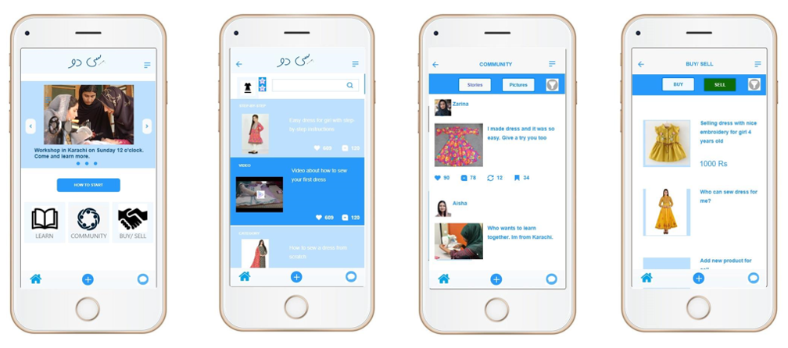

# SiDo
“Si do” means “Sew it” in urdu. 
Our goal is to empower women to take part in social and working life through sewing. 

We belive that lifelong learning can help promote gender equality, ensure equal access to employment, and ensure that everyone is included in the information socitey. 

# Intro

- <a href="#problem">Problem</a>

- <a href="#solution">Solution</a>
    - <a href="#how">How</a>
    
- <a href="#why-not-use-apps-that-already-exist">Why not use apps that already exist</a>
- <a href="#why-pakistan">Why Pakistan</a>
- <a href="#Impact">Impact</a>
    
# Problem
Young girls and women residing in different areas in Pakistan are facing poverty and unemployment where they do not have access to basic necessities nor education facility. Many drop out from schools to provide support at home <a href="https://tribune.com.pk/story/1701028/1-76-pakistan-youth-drop-education-undp/"> (Wasif, Sehrish 2018)</a>. When it comes to employment, the minority of the employed are women, this shows that there is absence of gender equality <a href="https://www.theglobaleconomy.com/Pakistan/Female_labor_force_participation/">(The Global Economy)</a>.
 

    
# Solution
We are working on a mobile application that gives the opportunity for women in Pakistan to learn how to sew. 
SiDo is educational, social and a hub for women in Pakistan. SiDo has a simple interface for that is easy to use by people with low levels of literacy and digital skills.
It has three main features:
- learning platform divided into three levels; for beginners, intermediate and advanced.
- social platform where user can ask questions and communicate with others.
- integrated hub for trading and exchanging materials, patterns and selling finished products.
    

### How
the Si Do application gives women the opportunity to develop their digital skills, discover new patterns, learn how to sell finished products, and be a source of inspiration and be inspired by other women, who shares the same interest.

With Si Do, women can learn, communicate, collaborate, and help build a community of women from distant cultures and from right next door. These relationships help them support one another and work together to create new businesses in the communities.

# Why not use apps that already exist?

Apps that already exist aren’t fit for purpose. For example:

- Social networking applications it’s where people go to get their news ad hear what their friends are doing. It’s not a learning platform. 

- Shopping platforms doesn’t have a place where people can network and exchange knowledge.

- Learning platforms like courses are likely to not provide a shopping platform.

So why create a new platform? It’s the mashup of the three functions of the SiDo app that makes it valuable and that also gives you the opportunity to make it responsive to the user’s needs. 

# Why Pakistan?
We chose to focus on Pakistan, because we have a strong connection to communities throughout this country. However, we acknowledge that Si Do can create value for women in other countries. 

We believe that Si Do can help both government and non-government organizations that aim to promote, lifelong learning, gender equality and social inclusion. Although Si Do is a social innovation, we also understand that it has commercial potential. Social investors or industry partners can use Si Do for advertising, selling fabrics to the community, or generating revenue from purchases on the platform. 

Si Do provides the means for learning more about the passion for sewing, for becoming an entrepreneur, and for connecting with the next generation to learn digital skills.

# Impact

Through SiDo
additional income to family through women, benefit the 

Network effects are really important to experiment with. The ability for users to share their creations and get predefined reactions, or to belong to a community of some sort.
Then its easier for users to recruit new users in their local communities. (This really makes sense when you start looking at multiple types of crafts, think local community pinterest for own creations)

If there will be commons space for women use a sewing machine, they can also get together and do this collectively or do any such embroidery in their own homes and Si Do can also guide them in getting the market
I wanted to have a chat with you, most importantly
your project is amazing with fantastic scope
as Francois mentioned yesterday(03/07/19) mention the background of the NGO support and the possibility availing the sewing machines, that makes a huge difference.

This is what Pakistan is rich for! Apart from learning sewing, empower the communities of Si Do to revive these rich embroidery work. Often to transfer these onto fabric material takes collective effort- the community space you are thinking of where there will be one sewing machine can also act as a community space- to bring women together and do some creative empowerment

Women mental health is least spoken about. collective stitching- as famously known as ‘Bitch & Stitch’ helps them handle with their depression better( If you want to bring in the Women Mental Health- and make that an SDG angle). 

